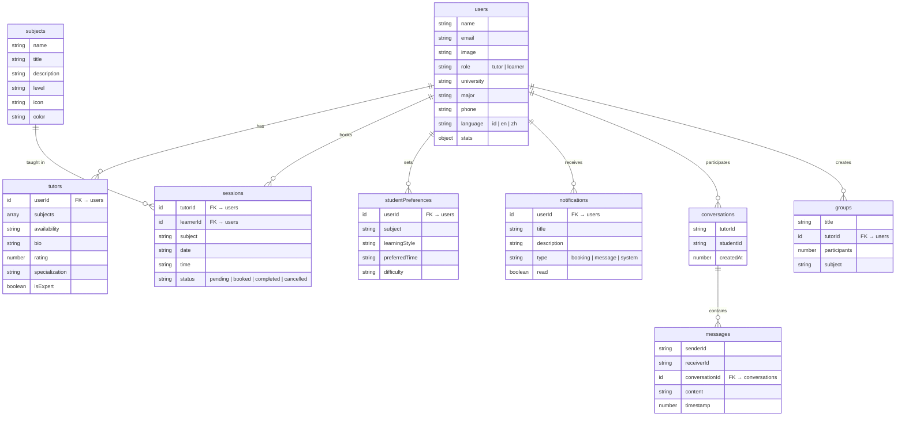

# 🎓 EduPartner AI

> **Aplikasi Mobile Tutoring Berbasis AI** — Final Project Mobile Application Development

EduPartner AI adalah platform tutoring mobile yang menghubungkan pelajar dengan tutor secara cerdas menggunakan kecerdasan buatan (AI). Dibangun dengan **React Native (Expo)** dan **Convex** sebagai backend real-time, aplikasi ini menyediakan pengalaman belajar yang personal dan interaktif.

---

## ✨ Fitur Utama

### 🤖 AI-Powered Features (Gemini AI)
| Fitur | Deskripsi |
|-------|-----------|
| **AI Chat Assistant** | Chatbot akademik cerdas (EduPartner AI) yang membantu menjawab pertanyaan pelajaran, memberikan penjelasan, dan tips belajar. Mendukung pemilihan model AI. |
| **AI Tutor Recommendation** | Sistem rekomendasi tutor berbasis AI yang menganalisis kebutuhan pelajar (mata pelajaran, gaya belajar, waktu preferensi) dan mencocokkan dengan tutor terbaik. |
| **AI Study Planner** | Generator rencana belajar otomatis yang membuat jadwal belajar harian berdasarkan mata pelajaran, tujuan, dan waktu yang tersedia. |
| **AI Scanner** | Fitur pemindai gambar yang menganalisis materi pelajaran atau soal dari foto, memberikan penjelasan dan solusi step-by-step. |

### 👨‍🎓 Fitur Pelajar (Learner)
- **Home Dashboard** — Tampilan utama dengan sesi mendatang, pencarian tutor, dan akses cepat ke fitur AI
- **Pencarian Tutor** — Cari dan filter tutor berdasarkan mata pelajaran, rating, dan ketersediaan
- **Profil Tutor** — Lihat detail tutor termasuk bio, spesialisasi, rating, dan jadwal
- **Booking Sesi** — Pesan sesi tutoring dengan tutor pilihan
- **Mata Pelajaran** — Jelajahi berbagai mata pelajaran yang tersedia
- **Chat** — Komunikasi langsung dengan tutor melalui pesan real-time
- **Progress Tracking** — Pantau kemajuan belajar dan statistik sesi
- **Notifikasi** — Pemberitahuan real-time untuk booking, pesan, dan sistem

### 👨‍🏫 Fitur Tutor
- **Tutor Dashboard** — Overview statistik dan manajemen sesi
- **Manajemen Profil** — Kelola profil, bio, dan spesialisasi
- **Manajemen Mata Pelajaran** — Atur mata pelajaran yang diajarkan
- **Pengaturan Ketersediaan** — Atur jadwal ketersediaan mengajar
- **Manajemen Request** — Terima/tolak permintaan sesi dari pelajar
- **Chat dengan Pelajar** — Komunikasi real-time dengan pelajar
- **Manajemen Sesi** — Kelola sesi tutoring yang sedang berjalan

### 🌐 Fitur Umum
- **Multi-bahasa** — Mendukung Bahasa Indonesia 🇮🇩, English 🇬🇧, dan Mandarin 🇨🇳
- **Dark Mode / Light Mode** — Tema gelap dan terang yang dapat diubah
- **Google OAuth Login** — Autentikasi cepat menggunakan akun Google
- **Email & Password Auth** — Registrasi dan login tradisional
- **Role-based Navigation** — Navigasi otomatis berdasarkan peran (Pelajar/Tutor)

---

## 🏗️ Arsitektur & Tech Stack

### Frontend
| Teknologi | Versi | Keterangan |
|-----------|-------|------------|
| **React Native** | 0.81.5 | Framework mobile cross-platform |
| **Expo** | ~54.0 | Development platform & toolchain |
| **Expo Router** | ~6.0 | File-based routing |
| **React Native Reanimated** | ~4.1 | Animasi performa tinggi |
| **TypeScript** | ~5.9 | Type-safe development |

### Backend
| Teknologi | Keterangan |
|-----------|------------|
| **Convex** | Backend-as-a-Service real-time (database, functions, auth) |
| **Convex Auth** | Sistem autentikasi terintegrasi |
| **Google Generative AI** | Gemini AI API untuk fitur kecerdasan buatan |

### AI Model
| Model | Penggunaan |
|-------|------------|
| **Gemma 3 27B IT** | Chat AI, Rekomendasi Tutor, Study Planner, Scanner |

---

## 📁 Struktur Proyek

```
Final_Project_MAD/
├── app/                          # Screens & Navigation
│   ├── (auth)/                   # Auth Screens
│   │   ├── login.tsx             # Login (Email/Google)
│   │   ├── register.tsx          # Registrasi Pelajar
│   │   ├── TutorRegisterScreen.tsx # Registrasi Tutor
│   │   └── ForgotPasswordScreen.tsx
│   ├── (tabs)/                   # Main Tab Screens (Learner)
│   │   ├── HomeScreen.tsx        # Dashboard Utama
│   │   ├── TutorListScreen.tsx   # Daftar Tutor
│   │   ├── SubjectScreen.tsx     # Daftar Mata Pelajaran
│   │   ├── AIChatScreen.tsx      # AI Chat Assistant
│   │   ├── ProfileScreen.tsx     # Profil Pengguna
│   │   ├── BookingScreen.tsx     # Booking Sesi
│   │   ├── ProgressScreen.tsx    # Progress Belajar
│   │   ├── AIPreferenceScreen.tsx # Preferensi AI
│   │   ├── AIResultScreen.tsx    # Hasil Rekomendasi AI
│   │   ├── ScannerScreen.tsx     # AI Document Scanner
│   │   ├── ScanResultScreen.tsx  # Hasil Scan
│   │   ├── StudyPlannerScreen.tsx # AI Study Planner
│   │   ├── StudyPlanResultScreen.tsx # Hasil Study Plan
│   │   ├── SubjectDetailScreen.tsx
│   │   ├── TutorProfileScreen.tsx
│   │   └── NotificationScreen.tsx
│   ├── chat/                     # Chat Screens
│   │   ├── ChatListScreen.tsx    # Daftar Percakapan
│   │   └── [id].tsx              # Detail Chat
│   ├── tutor/                    # Tutor-specific Screens
│   │   ├── TutorDashboardScreen.tsx
│   │   ├── TutorProfileScreen.tsx
│   │   ├── EditProfileScreen.tsx
│   │   ├── SubjectsScreen.tsx
│   │   ├── AvailabilityScreen.tsx
│   │   ├── RequestsScreen.tsx
│   │   ├── TutorChatListScreen.tsx
│   │   ├── TutorSessionsScreen.tsx
│   │   ├── SettingsScreen.tsx
│   │   └── _layout.tsx
│   ├── _layout.tsx               # Root Layout (Providers)
│   └── index.tsx                 # Entry Point
├── components/                   # Reusable Components
│   ├── BottomTabBar.tsx          # Custom Tab Bar (Learner)
│   ├── TutorTabBar.tsx           # Custom Tab Bar (Tutor)
│   ├── ChatBubble.tsx            # Chat Message Bubble
│   ├── CustomButton.tsx          # Reusable Button
│   ├── InputField.tsx            # Reusable Input
│   ├── RatingStars.tsx           # Star Rating Display
│   ├── RequestCard.tsx           # Session Request Card
│   ├── SessionCard.tsx           # Session Info Card
│   ├── SubjectCard.tsx           # Subject Display Card
│   └── TutorCard.tsx             # Tutor Profile Card
├── context/                      # React Context Providers
│   ├── LanguageContext.tsx        # Multi-language (i18n)
│   ├── ThemeContext.tsx           # Dark/Light Theme
│   ├── ProfileContext.tsx         # User Profile State
│   └── TutorSettingsContext.tsx   # Tutor Settings State
├── convex/                       # Backend (Convex)
│   ├── schema.ts                 # Database Schema
│   ├── users.ts                  # User Operations
│   ├── tutors.ts                 # Tutor Operations
│   ├── sessions.ts               # Session Management
│   ├── subjects.ts               # Subject Queries
│   ├── messages.ts               # Messaging System
│   ├── chat.ts                   # Chat Operations
│   ├── notifications.ts          # Notification System
│   ├── groups.ts                 # Group Study
│   ├── googleAuth.ts             # Google OAuth Helper
│   ├── http.ts                   # HTTP Endpoints (OAuth callback)
│   ├── auth.ts                   # Auth Configuration
│   ├── auth.config.ts            # Auth Provider Config
│   └── seed.ts                   # Database Seeding
├── services/                     # External Services
│   └── gemini.ts                 # Gemini AI Integration
├── assets/                       # Images & Static Assets
├── app.json                      # Expo Configuration
├── package.json                  # Dependencies
└── tsconfig.json                 # TypeScript Configuration
```

---

## 📊 Database Schema (Convex)



---

## 🚀 Getting Started

### Prerequisites

- **Node.js** ≥ 18.x
- **npm** atau **yarn**
- **Expo CLI** — `npm install -g expo-cli`
- **Expo Go** app di smartphone (untuk testing)
- **Convex Account** — [convex.dev](https://convex.dev)
- **Google Cloud Console** — Untuk OAuth credentials
- **Google AI Studio** — Untuk Gemini API Key

### Installation

1. **Clone repository**
   ```bash
   git clone https://github.com/prettyara12/Final_Project_MAD.git
   cd Final_Project_MAD
   ```

2. **Install dependencies**
   ```bash
   npm install
   ```

3. **Setup environment variables**

   Buat file `.env.local` di root project:
   ```env
   # Convex
   CONVEX_DEPLOYMENT=dev:your-deployment-name
   EXPO_PUBLIC_CONVEX_URL=https://your-deployment.convex.cloud
   EXPO_PUBLIC_CONVEX_SITE_URL=https://your-deployment.convex.site

   # Google OAuth
   EXPO_PUBLIC_GOOGLE_WEB_CLIENT_ID=your-google-client-id
   EXPO_PUBLIC_GOOGLE_CLIENT_SECRET=your-google-client-secret

   # Gemini AI
   EXPO_PUBLIC_GEMINI_API_KEY=your-gemini-api-key
   ```

4. **Setup Convex backend**
   ```bash
   npx convex dev
   ```

5. **Seed database** (opsional, untuk data dummy)
   ```bash
   npx convex run seed:seedDatabase
   ```

6. **Start the app**
   ```bash
   npx expo start
   ```

7. **Buka di perangkat**
   - Scan QR code dengan **Expo Go** (Android/iOS)
   - Tekan `a` untuk Android Emulator
   - Tekan `i` untuk iOS Simulator
   - Tekan `w` untuk Web Browser

---

## 🔧 Environment Variables

| Variable | Deskripsi | Diperlukan |
|----------|-----------|:----------:|
| `CONVEX_DEPLOYMENT` | Nama deployment Convex | ✅ |
| `EXPO_PUBLIC_CONVEX_URL` | URL Convex cloud | ✅ |
| `EXPO_PUBLIC_CONVEX_SITE_URL` | URL Convex site (HTTP endpoints) | ✅ |
| `EXPO_PUBLIC_GOOGLE_WEB_CLIENT_ID` | Google OAuth Client ID | ✅ |
| `EXPO_PUBLIC_GOOGLE_CLIENT_SECRET` | Google OAuth Client Secret | ✅ |
| `EXPO_PUBLIC_GEMINI_API_KEY` | Google Gemini AI API Key | ✅ |

> ⚠️ **Penting:** Jangan commit file `.env.local` ke repository. File ini sudah termasuk di `.gitignore`.

---

## 📱 Screenshots & User Flow

### Alur Pengguna (User Flow)

```
┌─────────────┐     ┌──────────────┐     ┌─────────────────┐
│   Splash     │────▶│    Login /   │────▶│  Pilih Peran    │
│   Screen     │     │   Register   │     │ (Pelajar/Tutor) │
└─────────────┘     └──────────────┘     └────────┬────────┘
                                                   │
                    ┌──────────────────────────────┼──────────────────────┐
                    │                              │                      │
                    ▼                              ▼                      ▼
          ┌─────────────────┐          ┌─────────────────┐     ┌──────────────────┐
          │  Home (Pelajar) │          │ Dashboard (Tutor)│     │  Google OAuth     │
          │  ├─ Cari Tutor  │          │  ├─ Statistik    │     │  Callback Flow   │
          │  ├─ AI Chat     │          │  ├─ Requests     │     └──────────────────┘
          │  ├─ Scanner     │          │  ├─ Sesi         │
          │  ├─ Study Plan  │          │  ├─ Chat         │
          │  └─ Booking     │          │  └─ Profil       │
          └─────────────────┘          └─────────────────┘
```

---

## 🧠 AI Integration Details

### Gemini AI Service (`services/gemini.ts`)

Aplikasi ini mengintegrasikan **Google Gemini AI** melalui 4 fungsi utama:

1. **`getGeminiResponse()`** — Chat AI interaktif dengan context history
2. **`getTutorRecommendation()`** — Analisis kebutuhan pelajar → rekomendasi tutor
3. **`generateStudyPlan()`** — Generate rencana belajar terstruktur (JSON)
4. **`analyzeScannedText()`** — Analisis gambar/teks materi pelajaran

Semua fungsi mendukung **multi-bahasa** dan memiliki **timeout handling** serta **rate limit detection**.

---

## 🤝 Tim Pengembang

| Nama | NIM | Peran |
|------|-----|-------|
| **Tiara Mamuaya** | — | Full-Stack Developer |

---

## 📄 Lisensi

Proyek ini dibuat untuk keperluan **Final Project** mata kuliah **Mobile Application Development**.

---

<div align="center">

**Built with ❤️ using React Native, Expo, Convex & Gemini AI**

</div>
